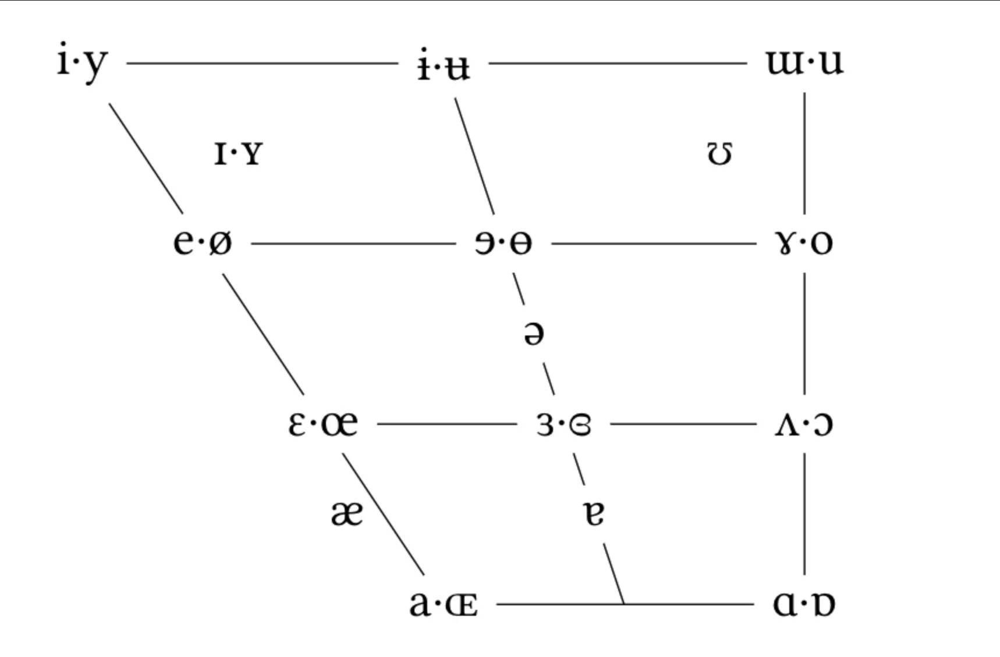
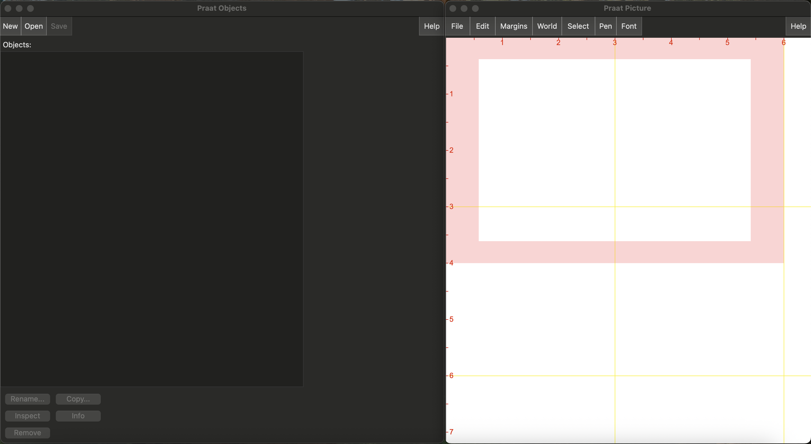
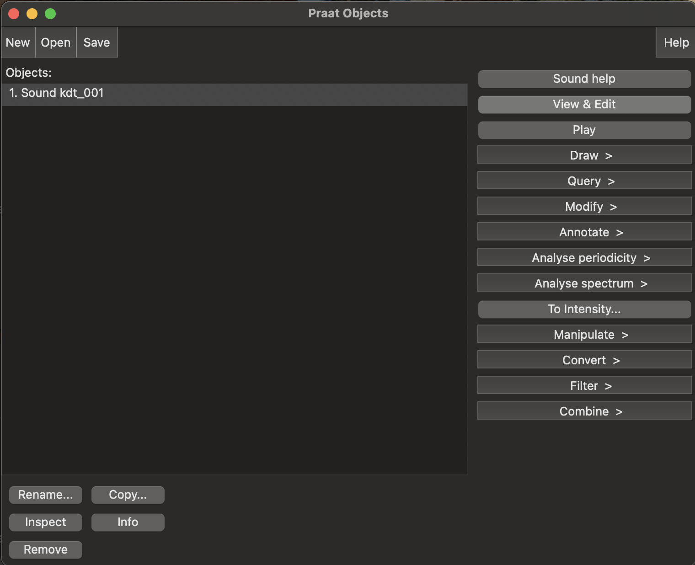
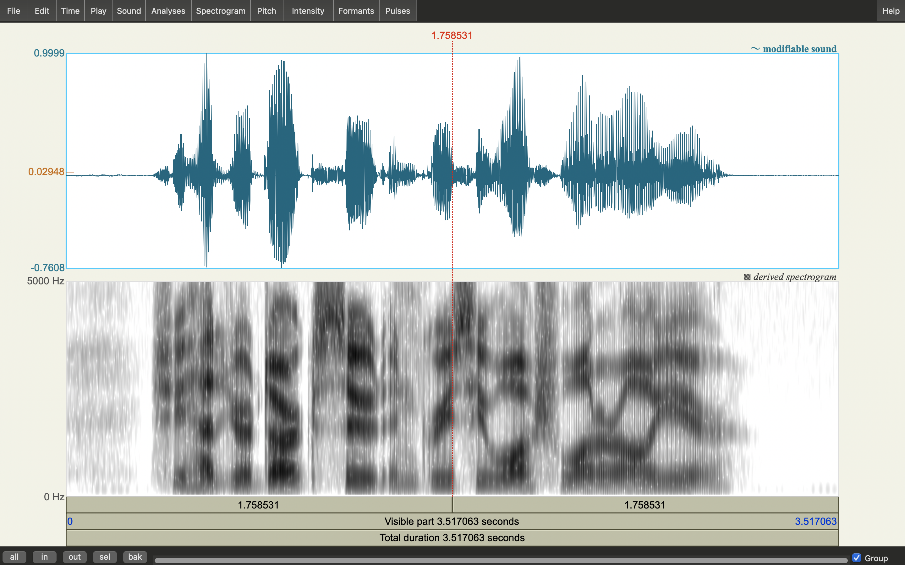
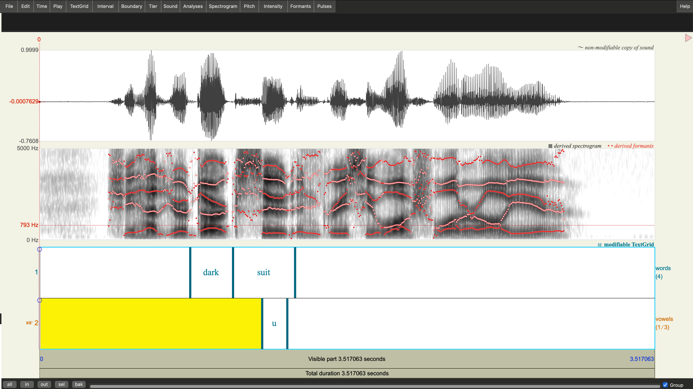

# Lecture 12: Speech Data II — Formants, Praat, and Annotation

Last time, we explored digital audio from the ground up: waveforms, sampling, Nyquist, FFT, and spectrograms. Today we shift from "how does digital audio work?" to "how do we analyze speech data in practice?"

The core tool for today is **Praat**, a free application for phonetic analysis. Since Praat is a GUI program (not a Python library), this lecture is a follow-along guide — read it in VS Code's markdown preview while working in Praat alongside.

**Prerequisites:**
- Lecture 11 (Speech Data I): waveforms, spectrograms, harmonics vs. noise
- The `ling250-materials` repository cloned and up to date (`git pull`)

---

## Getting Started

1. Open VS Code
2. Open this file (`lectures/lecture12_speech_data2_followalong.md`)
3. Open markdown preview side-by-side:
   - **Mac:** Cmd + K, then V
   - **Windows/Linux:** Ctrl + K, then V
4. Keep Praat open in a separate window (we'll install it in Part 2 if you haven't already)

---

## Part 1: Formants and the Vowel Space

At the end of last lecture, we saw that different vowels have energy concentrated at different frequencies. Those energy concentrations are called **formants** — and they're the key to understanding vowel identity.

### What are formants?

When you produce a vowel, two things happen simultaneously:

1. Your **vocal folds** vibrate, producing a harmonic series (F0, 2×F0, 3×F0, ...). This is the *source*.
2. Your **vocal tract** (throat, mouth, tongue position, lip shape) acts as a resonating chamber that amplifies some harmonics and dampens others. The resonant frequencies of the vocal tract are the *formants*.

Think of it like blowing across a bottle: the buzz of your lips is the source, and the bottle's shape determines which frequencies resonate. Change the shape (add water) and the resonance changes. Your tongue, jaw, and lips reshape your vocal tract the same way.

Formants are labeled F1, F2, F3, etc., from lowest to highest frequency. For vowel identity, **F1 and F2 are the workhorses**:

| Formant | Articulatory correlate | Relationship |
|---------|----------------------|--------------|
| **F1** | Vowel height | **Inverse**: high F1 ≈ low/open vowel; low F1 ≈ high/closed vowel |
| **F2** | Vowel backness | High F2 ≈ front vowel; low F2 ≈ back vowel |
| **F3** | Rhoticity, lip rounding | Less directly tied to a single dimension |

F3 and higher formants exist and matter for some distinctions (especially rhoticity in English), but F1 and F2 are sufficient to distinguish most vowels.

### The F1 × F2 vowel space

If you measure F1 and F2 for many vowel tokens and plot them (with F2 on the x-axis decreasing left-to-right and F1 on the y-axis decreasing bottom-to-top), you get a shape that looks remarkably like the **IPA vowel chart**:

```
          Front                    Back
         (high F2)              (low F2)
Close  ┌────────────────────────────┐  (low F1)
       │  i                    u    │
       │                            │
       │     e              o       │
       │                            │
       │        ɛ        ɔ          │
       │                            │
Open   │           a                │  (high F1)
       └────────────────────────────┘
```

This is not a coincidence — the IPA vowel chart was designed to capture the same articulatory space that F1 and F2 measure acoustically. The vowel chart is essentially a stylized F1 × F2 plot.



### Typical formant values

Here are rough F1/F2 values for some English vowels (adult male speaker — values are higher for female and child speakers due to shorter vocal tracts):

| Vowel | Example | F1 (Hz) | F2 (Hz) |
|-------|---------|---------|---------|
| /i/ | "heed" | ~300 | ~2300 |
| /ɪ/ | "hid" | ~350 | ~2100 |
| /ɛ/ | "head" | ~600 | ~1950 |
| /æ/ | "had" | ~850 | ~1550 |
| /ɑ/ | "hod" | ~850 | ~1150 |
| /ɔ/ | "hawed" | ~550 | ~800 |
| /ʊ/ | "hood" | ~400 | ~1100 |
| /u/ | "who'd" | ~350 | ~1250 |

Notice the patterns: /i/ has the lowest F1 (it's a high vowel) and the highest F2 (it's a front vowel). /ɑ/ has the highest F1 (low vowel) and a low F2 (back vowel).

---

## Part 2: Installing Praat

Praat (Dutch for "talk") is free, open-source software for phonetic analysis. It's been the standard tool in phonetics labs for decades.

### Download and install

Go to **[praat.org](https://www.praat.org)** and download the version for your operating system:

- **Mac:** Download the `.dmg`, open it, drag Praat to your Applications folder
- **Windows:** Download the `.zip`, extract it, and run `Praat.exe` (no installation needed — it's portable)
- **Linux:** Download the binary or install via your package manager (`sudo apt install praat` on Ubuntu/Debian)

### Orientation

When you open Praat, you'll see the **Objects window**. This is Praat's home base — it lists all the data objects (sounds, TextGrids, etc.) you have loaded.

Key areas of the Objects window:
- **Object list** (center): shows loaded objects
- **Menu bar** (top): Open, Save, etc.
- **Dynamic buttons** (right side): buttons that appear depending on what's selected

There's also a separate **Picture window** for creating publication-quality figures (we won't use it today).



### Loading an audio file

1. In Praat: **Open → Read from file...**
2. Navigate to your `ling250-materials/audio/` folder
3. Select `kdt_001.wav` and click **Open**

You should see a Sound object appear in the object list, named something like "Sound kdt_001".



> **Note:** `kdt_001.wav` is a short (~3 second) speech recording. It works well for demonstrating Praat's features, though a longer recording would give us more to annotate. If you want to experiment further, try recording yourself in Praat (New → Record mono Sound) or loading any `.wav` file you have.

---

## Part 3: Viewing Spectrograms and Waveforms in Praat

### Opening the editor

With "Sound kdt_001" selected in the object list, click **View & Edit** (on the right side of the Objects window).

A new editor window opens showing:
- **Top half:** the waveform (amplitude over time)
- **Bottom half:** a spectrogram (frequency over time, with intensity shown by darkness)

This should look familiar from lecture 11 — it's the same information we plotted with librosa, but now in an interactive tool.



### Navigating the editor

| Action | How |
|--------|-----|
| **Zoom in** | Select a region (click and drag), then Ctrl/Cmd + N ("zoom to selectioN") |
| **Zoom out** | Ctrl/Cmd + O ("zoom Out") |
| **Zoom to full** | Ctrl/Cmd + A ("zoom All") |
| **Play selection** | Tab (plays the selected region) |
| **Play visible** | Ctrl/Cmd + Tab (plays everything visible in the window) |
| **Select a region** | Click and drag in the waveform or spectrogram |

Try these now:
1. Click somewhere in the waveform — you'll see a red cursor line appear
2. Click and drag to select a region — it highlights in pink
3. Press Tab to listen to just that region
4. Zoom in to a vowel-like region (one with visible harmonic bands) using Ctrl/Cmd + N
5. Zoom back out with Ctrl/Cmd + A

### Spectrogram settings

If the spectrogram looks odd (too dark, too light, or cut off), you can adjust the settings:

**Spectrogram → Spectrogram settings...**

The most important settings:
- **View range (Hz):** Default is 0–5000 Hz. This is fine for most speech analysis. You can increase it to 8000 Hz to see higher-frequency fricatives.
- **Dynamic range (dB):** Default is 70 dB. Lowering this (e.g., to 50 dB) makes the spectrogram "crisper" by hiding low-energy details; raising it shows more detail but can look washed out.

For now, the defaults should work fine. Come back to these if something looks wrong.

---

## Part 4: Formant Tracking and Measurement

### Showing formant tracks

In the editor window, go to **Formants → Show formants**.

Red dots/tracks should appear overlaid on the spectrogram. Each track follows one formant:
- The **lowest track** is F1
- The **next one up** is F2
- And so on (F3, F4, F5 — though we mostly care about F1 and F2)


Look at the formant tracks during vowel-like portions of the signal. You should see the tracks at relatively stable positions. During consonants or silence, the tracks may jump around erratically — this is expected (formant tracking doesn't work well on non-vowel sounds).

### Measuring formants at a point

1. Click on a vowel in the spectrogram (put the cursor somewhere in the middle of a vowel — avoid the edges where the sound transitions)
2. Go to **Formants → Get first formant** — this gives you F1 at the cursor position
3. Go to **Formants → Get second formant** — this gives you F2

The values appear in the Info window (a separate text window that opens in the background).

### Measuring formants over a selection

You can also measure the **average** formant values over a selected region:
1. Click and drag to select a stable vowel region
2. **Formants → Get first formant** now reports the *average* F1 over the selection
3. **Formants → Get second formant** reports the average F2

Averaging over a region is often more reliable than a single-point measurement, especially for short vowels.

### Formant settings

If the formant tracks look wrong (tracking too many formants, or missing formants), you can adjust the analysis settings:

**Formants → Formant settings...**

- **Maximum formant (Hz):** Default is 5500 Hz (appropriate for adult male speakers). For female speakers or children, try 5500–6500 Hz.
- **Number of formants:** Default is 5. Sometimes reducing to 4 or increasing to 6 gives better results.

**When to adjust:** If F1 and F2 look reasonable but you're seeing weird jumps, or if a formant track seems to be "missing," try changing the maximum formant. This is the single most impactful setting.

### Exercise: Measure some vowels

Using `kdt_001.wav` (or a recording of your own voice):

1. Identify 2–3 vowels in the recording by listening and looking at the spectrogram
2. For each vowel, place your cursor in the stable middle portion
3. Record F1 and F2 values in the table below

| Vowel (your best guess) | F1 (Hz) | F2 (Hz) |
|--------------------------|---------|---------|
| | | |
| | | |
| | | |

Compare your values to the typical values table in Part 1. Do they roughly match what you'd expect for those vowels?

<details>
<summary>Tips if your values seem off</summary>

- Make sure you're measuring in the **middle** of the vowel, not at a transition
- Try adjusting the maximum formant setting (Formant → Formant settings)
- Values will differ from the table if the speaker is female (expect higher values overall) or if you're measuring a different dialect
- F1 and F2 are approximate — don't expect exact matches. Being within ~100 Hz of the table values is reasonable.

</details>

---

## Part 5: TextGrids and Annotation

So far we've been looking at audio and measuring it. But for systematic analysis, we need a way to **label** portions of the audio — to mark which sounds occur where. In Praat, this is done with **TextGrids**.

### What is a TextGrid?

A TextGrid is a set of **time-aligned labels** layered on top of an audio file. It's like a transcript, but every label is tied to a specific time region (or time point) in the recording.

TextGrids contain one or more **tiers**, which come in two types:

| Tier type | What it represents | Example |
|-----------|-------------------|---------|
| **Interval tier** | Segments with a start time and end time | Phonemes, syllables, words |
| **Point tier** | Instantaneous events (single time points) | Tone targets, burst onsets, glottal pulses |

Most linguistic annotation uses interval tiers.

### Creating a TextGrid

1. In the Objects window, select your Sound object ("Sound kdt_001")
2. Go to **Annotate → To TextGrid...**
3. You'll be prompted for tier names:
   - **All tier names:** enter the names separated by spaces, e.g., `word phone`
   - **Which of these are point tiers?:** leave blank (we want interval tiers for now)
4. Click **OK**

A new TextGrid object appears in the object list.

### Opening the TextGrid with the Sound

To annotate, you need to see the TextGrid and Sound together:

1. **Select both** the Sound and the TextGrid in the object list (Ctrl/Cmd+click)
2. Click **View & Edit**

Now the editor shows the waveform, spectrogram, and your TextGrid tiers at the bottom. You should see empty tiers labeled "word" and "phone" (or whatever you named them).



### Adding boundaries and labels

To annotate an interval tier:

1. Click on the tier you want to annotate (e.g., the "word" tier at the bottom)
2. Click in the waveform/spectrogram at the point where a boundary should go
3. Press **Enter** to insert a boundary at the cursor position
4. Click between two boundaries to select an interval
5. Type a label and press **Enter**

**Workflow for word-level annotation:**

1. Listen to the whole recording (Ctrl/Cmd + Tab)
2. Identify word boundaries by listening and looking at the spectrogram
3. Place boundaries at word onsets (where each word starts)
4. Label each interval with the word

**Workflow for phone-level annotation:**

1. Zoom in to a single word
2. Look for transitions in the spectrogram (changes in formant pattern, onset of noise, silences)
3. Place boundaries at phone onsets
4. Label each interval with the IPA symbol (or a practical approximation)

> **Tip:** Phone-level annotation is difficult and time-consuming. Don't worry about getting boundaries perfectly placed — even trained phoneticians disagree about exact boundary locations. The goal here is to understand the process, not to produce perfect annotations.

### Saving TextGrids

Save your TextGrid: **File → Save as text file...**

TextGrids are plain text files. You can open them in any text editor to see the format:

```
File type = "ooTextFile"
Object class = "TextGrid"

xmin = 0
xmax = 0.743
tiers? <exists>
size = 2
item []:
    item [1]:
        class = "IntervalTier"
        name = "word"
        xmin = 0
        xmax = 0.743
        intervals: size = 3
        intervals [1]:
            xmin = 0
            xmax = 0.15
            text = ""
        intervals [2]:
            xmin = 0.15
            xmax = 0.60
            text = "example"
        intervals [3]:
            xmin = 0.60
            xmax = 0.743
            text = ""
    item [2]:
        class = "IntervalTier"
        name = "phone"
        ...
```

The format is human-readable: each interval has a start time (`xmin`), end time (`xmax`), and a text label. This makes TextGrids easy to parse with scripts when you need to extract data programmatically.

### Exercise: Annotate a short segment

1. Create a TextGrid with two tiers: `word` and `phone`
2. Annotate a 1–2 word segment of `kdt_001.wav` at the word level
3. Then zoom in and try annotating the same segment at the phone level
4. Save your TextGrid

<details>
<summary>Tips for annotation</summary>

- Use the spectrogram to find transitions: vowels have harmonic bands, fricatives have noise, stops have silences followed by bursts
- Play individual intervals (select and press Tab) to verify your boundaries
- It's OK to use approximate phonetic labels if you're not sure of the exact IPA symbol
- Word boundaries are much easier than phone boundaries — start there

</details>

---

## Part 6: Beyond Praat

Praat is the most widely used tool for phonetic analysis, but it's not the only option. Here are a few other tools and techniques worth knowing about.

### ELAN

**[ELAN](https://archive.mpi.nl/tla/elan)** (from the Max Planck Institute) is an annotation tool designed for multimodal data — especially video + audio. It's widely used in:
- Field linguistics (documenting endangered languages)
- Gesture research
- Conversation analysis

ELAN handles **video**, which Praat doesn't — if your data involves visual information (sign language, gestures, facial expressions), ELAN is the way to go. The annotation concepts are similar (tiers, time-aligned labels), but the interface and file format differ.

### Forced alignment

Creating TextGrids by hand is slow. **Forced alignment** automates the process:

- **Input:** an audio file + a text transcript
- **Output:** a TextGrid with time-aligned word and phone boundaries

The aligner uses acoustic models (trained on large speech datasets) to figure out which part of the audio corresponds to which word and phone in the transcript.

The most widely used tool is the **[Montreal Forced Aligner (MFA)](https://montreal-forced-aligner.readthedocs.io/)**. It supports many languages and produces good-quality alignments for read speech. The output is a Praat TextGrid, so you can load it right back into Praat for analysis or correction.

If you're doing a speech-related term project and need aligned transcriptions for more than a few seconds of audio, forced alignment will save you enormous amounts of time compared to manual annotation.

### Praat scripting and Python

Praat has its own built-in scripting language for automating repetitive tasks (e.g., extracting F1/F2 from every vowel in a corpus). The scripting language is functional but idiosyncratic.

There are also Python packages that can read Praat files:
- **`textgrid`** — read and write TextGrid files
- **[`parselmouth`](https://parselmouth.readthedocs.io/)** — a Python interface to Praat's analysis functions (formant extraction, pitch tracking, etc.). It bundles Praat's source code directly, so no separate Praat installation is needed.

We won't use these today, but they're worth knowing about if you want to combine Praat-style analysis with Python data processing. There's an optional companion notebook — `lecture12_parselmouth_demo.ipynb` — that walks through the basics of Parselmouth if you want to try it.

---

## Challenge Exercises

### Challenge 1: Formant detective

Record yourself saying the vowels /i/, /ɑ/, and /u/ (as in "heed," "hod," "who'd") — hold each vowel for about 1 second with a brief pause between them. Load the recording in Praat, measure F1 and F2 for each vowel, and verify that:
- /i/ has the lowest F1 and highest F2
- /ɑ/ has the highest F1
- /u/ has a low F1 and low F2

<details>
<summary>Hint</summary>

To record in Praat: **New → Record mono Sound...** Then click Record, say your vowels, click Stop, and click "Save to list." The recording will appear in the Objects window.

</details>

### Challenge 2: TextGrid format

Open a saved TextGrid file in VS Code (or any text editor). Can you identify:
- How many tiers are there?
- What type is each tier (interval or point)?
- What are the start and end times of each labeled interval?

Try manually editing a label in the text file, save it, and reload it in Praat. Does your change appear?

<details>
<summary>Hint</summary>

Look for the `item [N]` blocks — each one is a tier. The `class` field tells you the tier type (`"IntervalTier"` or `"TextTier"` for point tiers). Each interval has `xmin`, `xmax`, and `text` fields.

</details>

### Challenge 3: Compare two speakers

If you're working with a partner, exchange recordings. Measure F1 and F2 for the same vowels from both speakers. Are the values similar? How do they differ? (Think about what factors might cause speaker-to-speaker variation.)

<details>
<summary>Things to consider</summary>

- Vocal tract length affects formant values — shorter vocal tracts (female speakers, children) produce higher formant frequencies overall
- Dialect differences can shift vowel positions in the F1/F2 space
- Even the same speaker produces different values on different repetitions — there's always some variability

</details>

---

## Quick Reference

### Key Praat operations

| Task | Menu path |
|------|-----------|
| Load audio | Open → Read from file... |
| Open editor | Select object → View & Edit |
| Show formants | (in editor) Formant → Show formants |
| Get F1 at cursor | Formant → Get first formant |
| Get F2 at cursor | Formant → Get second formant |
| Formant settings | Formant → Formant settings... |
| Spectrogram settings | Spectrogram → Spectrogram settings... |
| Create TextGrid | Annotate → To TextGrid... |
| Insert boundary | (in editor, on tier) Enter |
| Save TextGrid | File → Save as text file... |
| Record audio | New → Record mono Sound... |

### Editor navigation

| Action | Shortcut |
|--------|----------|
| Play selection | Tab |
| Play visible window | Ctrl/Cmd + Tab |
| Zoom to selection | Ctrl/Cmd + N |
| Zoom out | Ctrl/Cmd + O |
| Zoom to full | Ctrl/Cmd + A |

### Key terms

| Term | Definition |
|------|------------|
| **Formant** | Resonant frequency of the vocal tract; appears as a broad energy peak in the spectrum |
| **F1** | First formant; inversely related to vowel height |
| **F2** | Second formant; related to vowel backness (high F2 = front) |
| **F1 × F2 vowel space** | A plot of F1 vs. F2 that mirrors the IPA vowel chart |
| **TextGrid** | Praat's format for time-aligned annotation of audio |
| **Interval tier** | A TextGrid tier where labels span a time range (start to end) |
| **Point tier** | A TextGrid tier where labels mark a single time point |
| **Forced alignment** | Automatic creation of time-aligned transcriptions from audio + text |
| **Montreal Forced Aligner** | The most widely used tool for forced alignment |
| **ELAN** | Annotation tool for multimodal (audio + video) data |
| **Praat script** | Praat's built-in scripting language for automating analysis |
| **[parselmouth](https://parselmouth.readthedocs.io/)** | Python package that wraps Praat's analysis functions (bundled, no separate install needed) |
