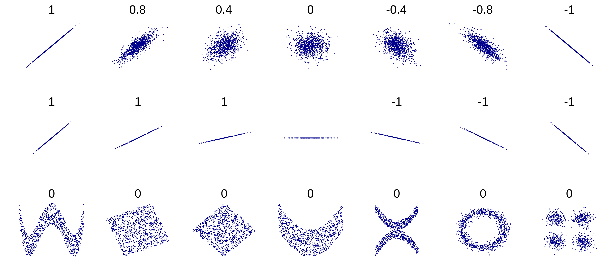
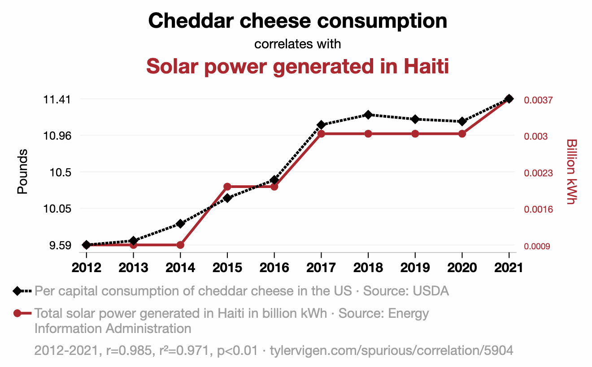
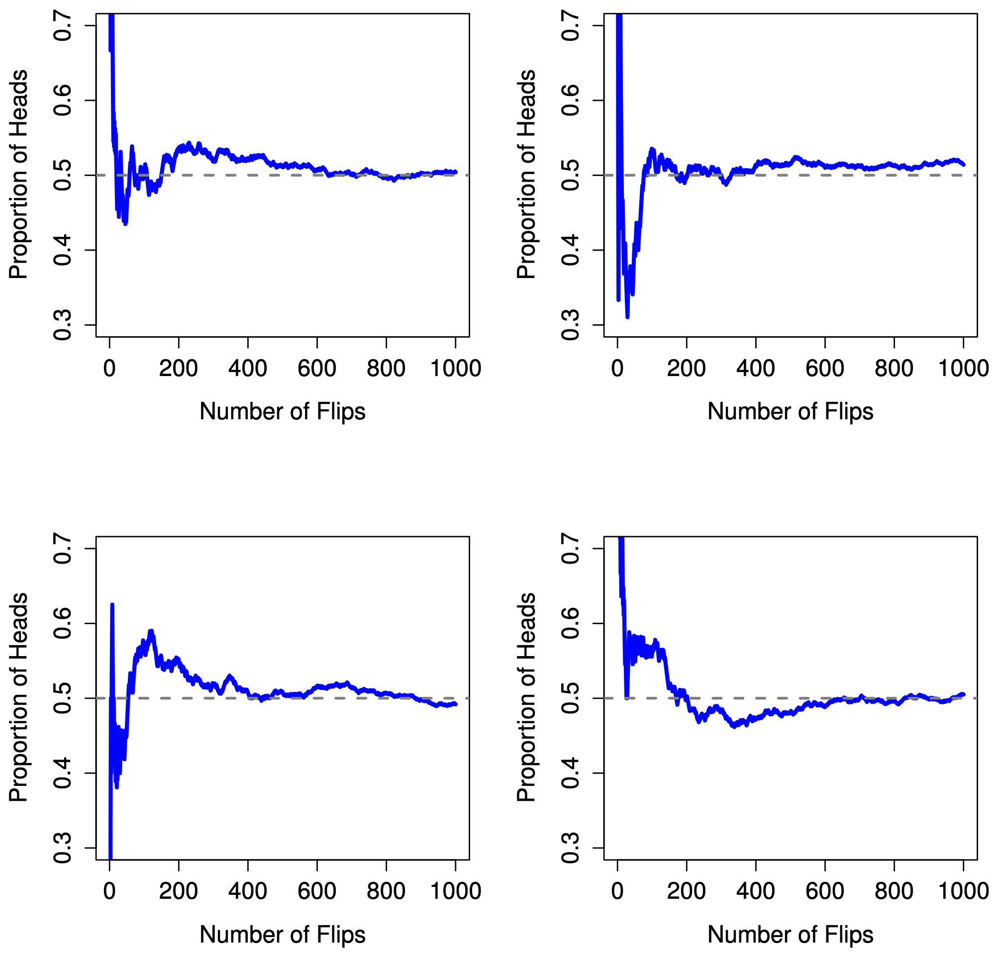

```{r setup, include=FALSE}
knitr::opts_chunk$set(echo = TRUE)
```

## Overview

This notebook covers two related topics:

1. **Correlation**: measuring relationships between variables
2. **Probability distributions**: the mathematical models that underlie
   statistical tests

These concepts bridge descriptive statistics (what we covered last time) and
inferential statistics (what we'll do next with hypothesis testing).

We'll continue using the `vowels.csv` dataset from last time.

```{r load_data}
vowels = read.csv("../data/vowels.csv")
library(dplyr)
```

---

## 1. Correlation

### What Is Correlation?

Correlation measures the **strength** and **direction** of a relationship
between two variables.

- **Positive correlation**: as X increases, Y also increases
- **Negative correlation**: as X increases, Y decreases
- **No correlation**: X and Y have no linear relationship

Correlation is expressed as a **coefficient** — a single number. The most
common is **Pearson's Correlation Coefficient**, written $r$.

### Covariance

Before getting to $r$, we need **covariance**. Recall from last time that
variance measures how much a single variable deviates from its mean:

$$Var(X) = \frac{1}{N} \sum_{i=1}^{N} (X_i - \bar{X})^2$$

Covariance is the same idea, but for **two variables** — it measures how much
they deviate *together*:

$$Cov(X, Y) = \frac{1}{N} \sum_{i=1}^{N} (X_i - \bar{X})(Y_i - \bar{Y})$$

Covariance tells you the direction of the relationship (positive or negative),
but its magnitude depends on the scales of X and Y, so it's hard to interpret
directly — just like variance.

```{r covariance}
cov(vowels$F1, vowels$F2)
```

### Pearson's Correlation Coefficient

The correlation coefficient ($r$) **normalizes** the covariance by the
standard deviations of both variables:

$$r_{XY} = \frac{Cov(X, Y)}{\sigma_X \sigma_Y}$$

This normalization puts $r$ in the range **-1 to +1**:

- $r = +1$: perfect positive linear relationship
- $r = -1$: perfect negative linear relationship
- $r = 0$: no linear relationship

In R, use `cor()`:

```{r cor_basic}
cor(vowels$F1, vowels$F2)
```

```{r cor_height}
cor(vowels$F1, vowels$HEIGHT)
```

### Interpreting Correlation

Here's what different correlation coefficients look like as scatterplots:

```{r corr_viz, echo=FALSE, out.width="100%"}

```

The strength labels below are rough guidelines — what counts as "strong"
depends heavily on the field and context. In some domains, $r < 0.95$ is
considered weak; in others, $r > 0.3$ counts as strong.

| Correlation | Strength | Direction |
|-------------|----------|-----------|
| -1.0 to -0.9 | Very strong | Negative |
| -0.9 to -0.7 | Strong | Negative |
| -0.7 to -0.4 | Moderate | Negative |
| -0.4 to -0.2 | Weak | Negative |
| -0.2 to 0.2 | Negligible | |
| 0.2 to 0.4 | Weak | Positive |
| 0.4 to 0.7 | Moderate | Positive |
| 0.7 to 0.9 | Strong | Positive |
| 0.9 to 1.0 | Very strong | Positive |

Important: the absolute value of $r$ tells you how **tight** the relationship
is — not the **slope**. A steep line with scattered points can have a lower
$r$ than a shallow line with tightly clustered points.

### Correlation Does Not Imply Causation

Even a strong correlation tells you nothing about **why** two variables are
related:

- X might cause Y
- Y might cause X
- Some third variable might cause both
- Or it could be pure coincidence

There are many examples of **spurious correlations** — variables that
correlate strongly but have no causal connection:

```{r spurious, echo=FALSE, out.width="80%"}

```

Browse more at [tylervigen.com/spurious-correlations](https://www.tylervigen.com/spurious-correlations).

### Anscombe's Quartet

**Anscombe's quartet** is a famous set of four datasets that all have the
**exact same** correlation coefficient, mean, variance, and regression line —
but look completely different when plotted:

```{r anscombe}
# R has Anscombe's quartet built in
data(anscombe)

par(mfrow = c(2, 2))
plot(anscombe$x1, anscombe$y1, main = paste("Set 1: r =", round(cor(anscombe$x1, anscombe$y1), 2)),
     xlab = "x1", ylab = "y1", pch = 19)
plot(anscombe$x2, anscombe$y2, main = paste("Set 2: r =", round(cor(anscombe$x2, anscombe$y2), 2)),
     xlab = "x2", ylab = "y2", pch = 19)
plot(anscombe$x3, anscombe$y3, main = paste("Set 3: r =", round(cor(anscombe$x3, anscombe$y3), 2)),
     xlab = "x3", ylab = "y3", pch = 19)
plot(anscombe$x4, anscombe$y4, main = paste("Set 4: r =", round(cor(anscombe$x4, anscombe$y4), 2)),
     xlab = "x4", ylab = "y4", pch = 19)
par(mfrow = c(1, 1))
```

The lesson: **always visualize your data** alongside descriptive statistics.
A single number can hide important structure.

### Correlation Matrix

If you call `cor()` on a data frame (with only numeric columns), it returns
a **correlation matrix** — the correlation between every pair of variables.
Note that every variable is perfectly correlated with itself (the diagonal
is all 1s).

```{r cor_matrix}
numeric_cols = data.frame(
  F1 = vowels$F1,
  F2 = vowels$F2,
  HEIGHT = vowels$HEIGHT
)
cor(numeric_cols)
```

<details>
<summary>**Challenge:** Look at the correlation matrix. Which pair of
variables has the strongest correlation? Is it positive or negative?</summary>

F1 and HEIGHT have the strongest correlation at about -0.20 (negative). F1
and F2 are close at about -0.15. None of these are particularly strong —
they're all in the "negligible" to "weak" range.
</details>

---

## 2. Probability Distributions

### Random Variables

We often want to know the **probability** of a specific outcome:

- How likely is it to get heads on a coin flip?
- To roll a 6 on a die?
- That a randomly selected English speaker produces a certain F1 value?

We model this with a **random variable** ($X$), which represents possible
outcomes. For example, if $X$ is the result of rolling a die:

- $X = 1$ means we rolled a 1
- $P(X = 1)$ is the **probability** of rolling a 1 (which is $1/6$)

### Probability Distributions

A **probability distribution** expresses the likelihood of **all possible
outcomes**. The probabilities must **add up to 1** (i.e., 100%).

For **discrete** variables, this can be written as a table:

| Outcome | Probability |
|---------|-------------|
| $X = 1$ | 1/6 |
| $X = 2$ | 1/6 |
| $X = 3$ | 1/6 |
| $X = 4$ | 1/6 |
| $X = 5$ | 1/6 |
| $X = 6$ | 1/6 |

A bar plot of this table is called a **Probability Mass Function** (PMF).

### The Frequentist Perspective

What do we actually **mean** when we say "the probability of heads is 0.5"?

The **frequentist** interpretation: it is the overall frequency of an outcome
when the experiment is **repeated many times**. Simulating many coin flips and
tracking the running proportion of heads illustrates this:

```{r coinflip_img, echo=FALSE, out.width="80%"}

```

We can reproduce this in R:

```{r frequentist}
# Simulate flipping a fair coin many times and track the running proportion
set.seed(42)
flips = sample(c("heads", "tails"), size = 1000, replace = TRUE)

# Calculate the running proportion of heads
running_prop = cumsum(flips == "heads") / 1:1000

plot(1:1000, running_prop, type = "l", col = "blue",
     xlab = "Number of Flips", ylab = "Proportion of Heads",
     main = "Proportion of Heads Over Many Flips")
abline(h = 0.5, lty = 2, col = "gray")
```

The proportion bounces around at first, but converges toward 0.5 as the
number of flips grows.

### Note on Independence

Two events are **independent** if neither outcome influences the other. If
two events are independent, their **joint probability** is the product:

$$P(X = x) \cdot P(Y = y)$$

For example, the probability of flipping heads twice in a row:
$0.5 \times 0.5 = 0.25$. This works because coin flips are independent.

Not everything is independent though! For instance, the outcome of a team's
second game is not independent of their first — injuries, morale, and other
factors carry over.

---

## 3. Important Distributions

### The Binomial Distribution

The Binomial distribution models the number of **"successful" outcomes** in
a set of **repeated, independent experiments** where each trial has two
possible outcomes (e.g., heads/tails, win/lose, pass/fail).

It is defined by two **parameters**:

- **Number of trials** ($N$): how many times we repeat the experiment
- **Success probability** ($\theta$): the probability of "success" on each
  individual trial

Notation: $X \sim \text{Binomial}(\theta, N)$ means "$X$ is distributed
according to the Binomial distribution with success rate $\theta$ and $N$
trials."

Example: if we flip a fair coin 100 times, how many heads should we expect?

#### Binomial Distribution in R

Use `dbinom()` to get the **probability** of a specific outcome:

```{r dbinom_basic}
# Probability of getting exactly 50 heads out of 100 fair coin flips
dbinom(x = 50, size = 100, prob = 0.5)
```

If you pass a **vector** for `x`, you get the probability for **each** value
— this is the easiest way to plot the distribution:

```{r dbinom_plot}
# Plot the full Binomial distribution for 100 fair coin flips
probs = dbinom(x = 0:100, size = 100, prob = 0.5)
plot(0:100, probs, type = "h", col = "blue", lwd = 2,
     xlab = "Number of Heads", ylab = "Probability",
     main = "Binomial(0.5, 100)")
```

<details>
<summary>**Challenge:** Plot the Binomial distribution for 20 flips of an
unfair coin with $\theta = 0.7$. Where is the peak?</summary>

```{r challenge_binom}
probs_unfair = dbinom(x = 0:20, size = 20, prob = 0.7)
plot(0:20, probs_unfair, type = "h", col = "blue", lwd = 2,
     xlab = "Number of Successes", ylab = "Probability",
     main = "Binomial(0.7, 20)")
```

The peak is at 14, which makes sense: $0.7 \times 20 = 14$.
</details>

### The Normal Distribution

The Normal distribution (also called the **Gaussian distribution** or **bell
curve**) is the most important distribution in statistics. It has useful
mathematical properties and appears frequently in nature.

It is parameterized by:

- **Mean** ($\mu$): the center of the distribution
- **Standard deviation** ($\sigma$): the spread

Notation: $X \sim \text{Normal}(\mu, \sigma)$

Key differences from the Binomial:

- The Normal is **continuous** — $X$ can take any real value
- The y-axis is **probability density**, not probability
- The **area under the curve** adds to 1

Different $\mu$ values **shift** the curve left/right. Higher $\sigma$
**flattens** the curve.

#### Normal Distribution in R

`dnorm()` gives the probability **density** at a point (not a probability —
density values can be greater than 1):

```{r dnorm_basic}
dnorm(x = 0, mean = 0, sd = 1)
```

For continuous variables, what we usually care about is the probability of
$X$ falling within a **range**. `pnorm()` gives the **cumulative
probability** up to a given value:

```{r pnorm}
# What proportion of the distribution falls below 1.0?
pnorm(1.0, mean = 0, sd = 1)

# Probability that X is between 1.0 and 1.5
pnorm(1.5, mean = 0, sd = 1) - pnorm(1.0, mean = 0, sd = 1)
```

#### Plotting the Normal Distribution

```{r plot_normal}
x_vals = seq(-4, 4, by = 0.1)
plot(x_vals, dnorm(x_vals, mean = 0, sd = 1), type = "l", col = "blue", lwd = 2,
     xlab = "Observed Value", ylab = "Probability Density",
     main = "Standard Normal Distribution (mean=0, sd=1)")
```

We can overlay two Normal distributions with different parameters to see how
$\mu$ and $\sigma$ affect the shape:

```{r plot_normal_compare}
x_vals = seq(-2, 12, by = 0.1)
plot(x_vals, dnorm(x_vals, mean = 4, sd = 1), type = "l", col = "blue", lwd = 2,
     xlab = "Observed Value", ylab = "Probability Density",
     main = "Two Normal Distributions")
lines(x_vals, dnorm(x_vals, mean = 5, sd = 2), lty = 2, col = "blue", lwd = 2)
legend("topright", legend = c("Normal(4, 1)", "Normal(5, 2)"),
       lty = c(1, 2), col = "blue", lwd = 2)
```

### Why Learn These Distributions?

We often want to **characterize** the distribution of real-world data by
**modeling** it with one of these well-studied distributions. The model is
useful insofar as it fits, explains, or predicts the data — real data doesn't
always perfectly match.

Many statistical techniques **assume** certain aspects of the data are
Normally distributed. For instance, linear regression assumes the model
**errors** are Normal. This isn't always true, but we'll work with these
simplifying assumptions in this class.

---

## 4. Samples and Populations

### Descriptive vs. Inferential Statistics

- **Descriptive statistics**: concisely summarize "what we know" (from the
  data we have)
- **Inferential statistics**: learn about "what we do **not** know" from what
  we do

The data we collect is **what we draw inferences from**, but usually **not
what we draw inferences about**:

- Our data is a **sample** taken from a larger **population**
- The **population** is what we actually want to learn about
- Example: `vowels.csv` only has data from a handful of speakers, but we
  use it to make generalizations about English speakers in general

### Sampling

A sample is by definition **incomplete**: the population of interest is often
arbitrarily large ("all U.S. adults," "all English speakers"). Ideally, we
want a **random sample** where all members of the population have an equal
chance of being included — but this is essentially impossible in practice.

In **experimental design**, it's important to:

- Be precise about the **population of interest**
- Be conscious of how the sample **does or does not represent** the population

### Sampling Bias

In real life, sampling almost always introduces **bias**. A classic example
is election polling: U.S. political polls are typically administered by phone,
but the type of person willing to answer a strange number and complete a
survey is **not representative** of the average voter. This creates a known
bias toward older, more politically engaged respondents.

There are methods to **adjust** for sampling bias, but it's nearly impossible
to eliminate entirely.

### The Law of Large Numbers

The **Law of Large Numbers** formalizes an intuition most people already have:
the larger the sample, the better it approximates the population.

We can observe this by **sampling from a known distribution** in R. `rnorm()`
draws random samples from the Normal distribution:

```{r law_large_numbers}
set.seed(123)

par(mfrow = c(2, 2))
hist(rnorm(n = 10, mean = 0, sd = 1), breaks = 8,
     main = "n = 10", xlab = "value", xlim = c(-4, 4))
hist(rnorm(n = 100, mean = 0, sd = 1), breaks = 15,
     main = "n = 100", xlab = "value", xlim = c(-4, 4))
hist(rnorm(n = 1000, mean = 0, sd = 1), breaks = 25,
     main = "n = 1,000", xlab = "value", xlim = c(-4, 4))
hist(rnorm(n = 10000, mean = 0, sd = 1), breaks = 40,
     main = "n = 10,000", xlab = "value", xlim = c(-4, 4))
par(mfrow = c(1, 1))
```

With 10 samples, the histogram looks nothing like a bell curve. With 10,000,
the shape is unmistakable.

### Sampling Distributions and the Central Limit Theorem

What sample size is **large enough** to adequately represent the population?
We can address this with **sampling distributions**.

A sampling distribution is formed by repeatedly taking samples of a fixed
size from the same population and computing a statistic (like the mean) for
each sample. The result is the **Sampling Distribution of the Mean**.

A remarkable fact: the Sampling Distribution of the Mean is **always
approximately Normal**, even if the underlying population is not. This is the
**Central Limit Theorem** (CLT).

The spread of this sampling distribution is called the **Standard Error of
the Mean** (SEM):

$$SEM = \frac{\sigma}{\sqrt{N}}$$

where $\sigma$ is the population standard deviation and $N$ is the sample
size. This tells us by approximately **how much** a sample mean will deviate
from the population mean — and it gets smaller as $N$ grows.

We can demonstrate the CLT by sampling from a distribution that is decidedly
**not** Normal. The **Beta distribution** (with certain parameters) has a
U-shape — most of its mass is at the extremes, with very little in the middle:

```{r beta_shape}
# Plot the Beta(0.5, 0.5) distribution — decidedly not Normal
x_vals = seq(0.01, 0.99, by = 0.01)
plot(x_vals, dbeta(x_vals, shape1 = 0.5, shape2 = 0.5), type = "h", col = "blue", lwd = 2,
     xlab = "value", ylab = "probability density",
     main = "Beta Distribution (not Normally distributed)")
```

Now watch what happens to the **distribution of sample means** as we increase
sample size. Each bar below shows the mean of one random sample drawn from
this Beta distribution:

```{r clt_demo}
set.seed(42)

par(mfrow = c(2, 2))
for (sample_size in c(2, 4, 8, 16)) {
  sample_means = replicate(1000, mean(rbeta(sample_size, shape1 = 0.5, shape2 = 0.5)))
  hist(sample_means, breaks = 25,
       main = paste("Beta sample means (size", sample_size, ")"),
       xlab = "mean", xlim = c(-0.5, 1.5))
}
par(mfrow = c(1, 1))
```

Even though the underlying Beta distribution is U-shaped (not Normal at all),
the **means** of samples from it converge toward a bell curve as sample size
grows — and the curve gets narrower. This is the Central Limit Theorem in
action.

---

## Quick Reference

| Task | R code |
|------|--------|
| Covariance | `cov(x, y)` |
| Correlation | `cor(x, y)` |
| Correlation matrix | `cor(data_frame)` |
| Binomial probability | `dbinom(x, size, prob)` |
| Cumulative binomial | `pbinom(q, size, prob)` |
| Normal density | `dnorm(x, mean, sd)` |
| Cumulative normal | `pnorm(q, mean, sd)` |
| Random normal samples | `rnorm(n, mean, sd)` |
| Random binomial samples | `rbinom(n, size, prob)` |
